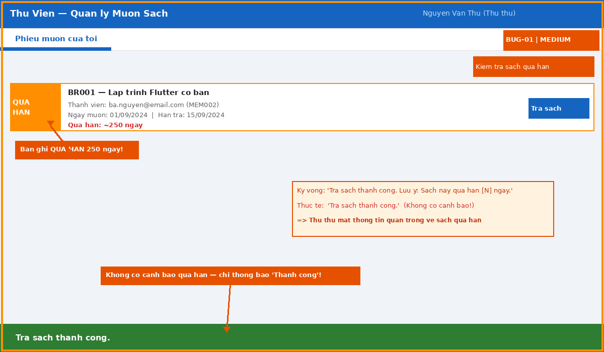
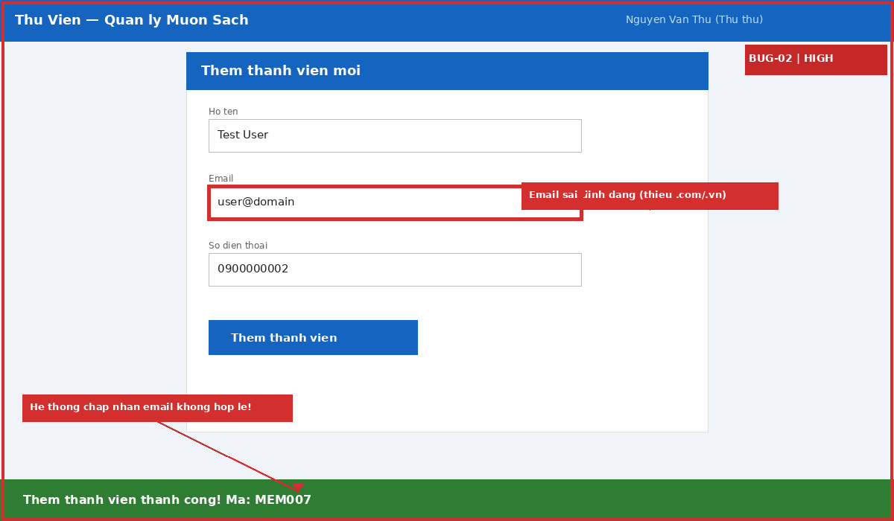
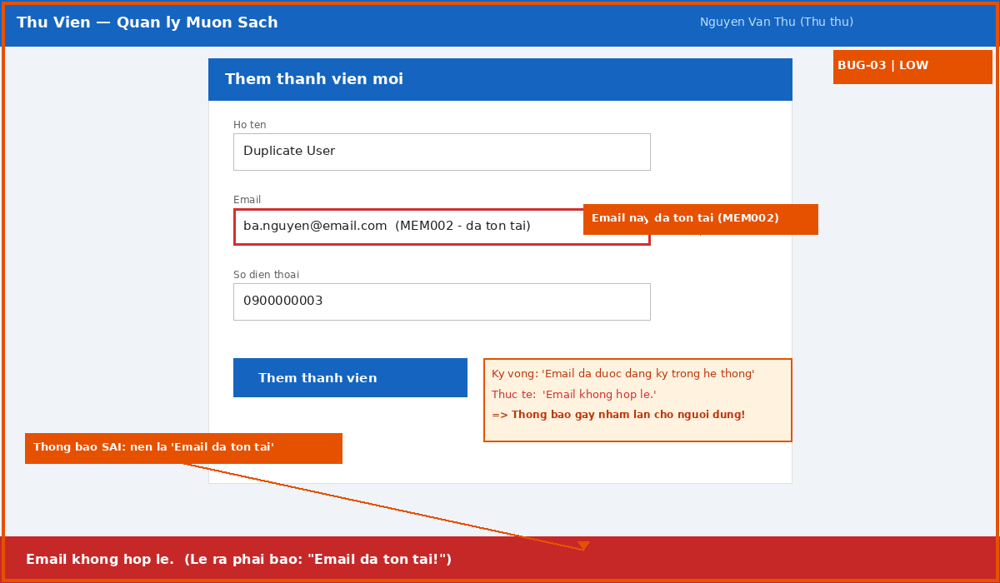
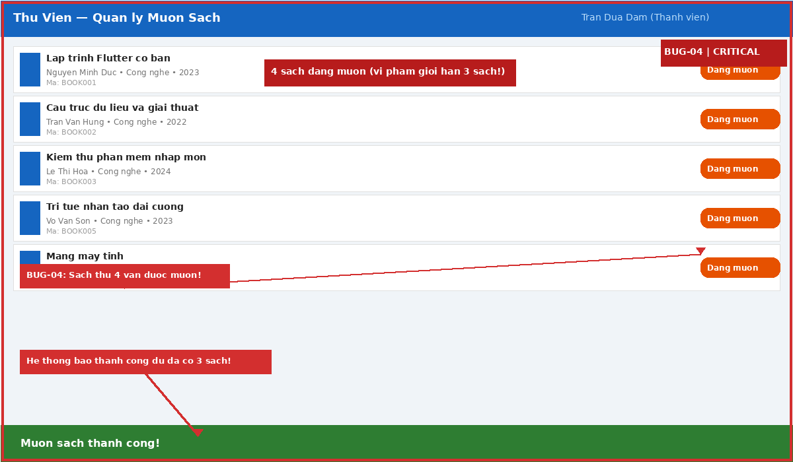

# Bug Reports — STQA Group 31

| Info | |
|---|---|
| **Group** | Group 31 |
| **Report Date** | 23/05/2026 |
| **System Under Test** | https://stqa.rbc.vn |
| **Reference** | SRS v1.0, test-execution.md |

---

## Bug Summary

| Bug ID | Title | Severity | Priority | Status | Found in TC |
|--------|-------|----------|----------|--------|-------------|
| BUG-01 | No overdue warning when returning an overdue book | Medium | P2 | Open | TC-17 |
| BUG-02 | Invalid email format accepted when adding a member | High | P1 | Open | TC-21 |
| BUG-03 | Misleading error message for duplicate email on member add | Low | P3 | Open | TC-22 |
| BUG-04 | System allows borrowing beyond the 3-book limit per member | Critical | P1 | Open | TC-13 |

---

## BUG-01 — No Overdue Warning When Returning an Overdue Book

| Field | Detail |
|---|---|
| **Bug ID** | BUG-01 |
| **Title** | No overdue warning displayed when returning an overdue book |
| **Severity** | Medium |
| **Priority** | P2 |
| **Status** | Open |
| **Found in TC** | TC-17 |
| **REQ** | REQ-05 |
| **Date Found** | 23/05/2026 |
| **Reporter** | Group 31 |

### Description

When a librarian returns a book that is marked as "Overdue", the system should display an overdue warning notification alongside the success message. However, the system only shows a generic "Book returned successfully." toast without any indication that the book was overdue.

### Steps to Reproduce

1. Log in as Librarian (`librarian@library.com` / `admin123`).
2. Go to "Mượn / Trả" (Borrow / Return) tab.
3. Click "Kiểm tra sách quá hạn" (Check Overdue Books) button.
4. Locate record **BR001** which has been overdue since 15/09/2024.
5. Click the "Trả sách" (Return Book) button for BR001.

### Expected Result

The system should display a message that includes both:
- Confirmation that the book was returned successfully.
- A warning that the book was overdue (e.g., "Book returned. Note: this book was overdue by X days.").

### Actual Result

Only the toast message **"Trả sách thành công."** is displayed. No overdue warning is shown. The record status changes to "Đã trả" (Returned) without any overdue annotation.

### Impact

Librarians lose critical context about overdue returns. They cannot track which members habitually return books late without checking the record history manually. This may affect the enforcement of library policies around overdue penalties.

### Evidence

*The screenshot shows BR001 with "Quá hạn" (Overdue) status visible in the record list. After clicking "Trả sách", only the generic "Trả sách thành công." toast appears at the bottom — no overdue warning is displayed anywhere on screen.*

---

## BUG-02 — Invalid Email Format Accepted When Adding a Member

| Field | Detail |
|---|---|
| **Bug ID** | BUG-02 |
| **Title** | Email with missing dot in domain (e.g. `user@domain`) is accepted when adding a new member |
| **Severity** | High |
| **Priority** | P1 |
| **Status** | Open |
| **Found in TC** | TC-21 |
| **REQ** | REQ-07 |
| **Date Found** | 23/05/2026 |
| **Reporter** | Group 31 |

### Description

According to SRS REQ-07, the system must validate that member email addresses are in a proper format. However, when a librarian enters an email address without a dot in the domain portion (e.g., `user@domain`), the system accepts it and creates a new member record without any validation error.

### Steps to Reproduce

1. Log in as Librarian (`librarian@library.com` / `admin123`).
2. Click the "Add Member" icon on the AppBar.
3. In the Add Member form, enter:
   - Name: `Test User`
   - Email: `user@domain` *(no dot in domain — invalid format)*
   - Phone: `0900000002`
4. Click "Thêm thành viên" (Add Member).

### Expected Result

The system should reject the submission and display a validation error such as:
> "Invalid email format. Please enter a valid email address."

No new member record should be created.

### Actual Result

The system accepts the input and displays:
> **"Thêm thành viên thành công! Mã: MEM007"**

A new member is created in the system with the invalid email address `user@domain`.

### Impact

- Data integrity is compromised — invalid email addresses are stored in the database.
- The system cannot send email notifications to members with invalid addresses.
- Potential security risk: malformed data may cause issues in downstream processes.

### Evidence

*The screenshot shows the Add Member form with email `user@domain` (no dot in domain) submitted. The system responds with the success toast "Thêm thành viên thành công! Mã: MEM007" — confirming a new member record was created despite the invalid email format.*

---

## BUG-03 — Misleading Error Message for Duplicate Email on Member Add

| Field | Detail |
|---|---|
| **Bug ID** | BUG-03 |
| **Title** | Adding a member with an already-existing email shows "Invalid email" instead of "Email already exists" |
| **Severity** | Low |
| **Priority** | P3 |
| **Status** | Open |
| **Found in TC** | TC-22 |
| **REQ** | REQ-07 |
| **Date Found** | 23/05/2026 |
| **Reporter** | Group 31 |

### Description

When a librarian attempts to add a new member using an email address that is already registered in the system, the system correctly rejects the request but displays a misleading error message. Instead of stating that the email address is already in use, it shows "Email không hợp lệ." ("Invalid email"), which is the same message used for format validation errors. This confuses users about the real cause of the failure.

### Steps to Reproduce

1. Log in as Librarian (`librarian@library.com` / `admin123`).
2. Click the "Add Member" icon on the AppBar.
3. In the Add Member form, enter:
   - Name: `Duplicate User`
   - Email: `ba.nguyen@email.com` *(already exists as MEM002)*
   - Phone: `0900000003`
4. Click "Thêm thành viên" (Add Member).

### Expected Result

The system should reject the submission with a clear message such as:
> "This email address is already registered in the system."

### Actual Result

The system rejects the submission but displays:
> **"Email không hợp lệ."** ("Invalid email.")

This message incorrectly implies the email format is wrong, not that it is a duplicate.

### Impact

- Poor user experience: librarians do not understand whether the problem is the email format or a duplicate.
- Support overhead increases as users cannot self-diagnose the issue.
- Minor issue compared to BUG-02, but creates confusion in member management workflows.

### Evidence

*The screenshot shows the Add Member form submitted with existing email `ba.nguyen@email.com`. The system displays "Email không hợp lệ." — an incorrect error message that implies a format problem rather than informing the librarian that the email is already registered.*

---

## BUG-04 — System Allows Borrowing Beyond the 3-Book Limit Per Member

| Field | Detail |
|---|---|
| **Bug ID** | BUG-04 |
| **Title** | Member can borrow more than 3 books simultaneously — borrow limit not enforced |
| **Severity** | Critical |
| **Priority** | P1 |
| **Status** | Open |
| **Found in TC** | TC-13 |
| **REQ** | REQ-04 |
| **Date Found** | 23/05/2026 |
| **Reporter** | Group 31 |

### Description

According to SRS REQ-04, each member is permitted to borrow a maximum of **3 books** at any one time. When a member who already has 3 active borrow records attempts to borrow a 4th book, the system should display an error and refuse the transaction. However, the system accepts the borrow request and allows the member to exceed the limit without any warning or error.

### Steps to Reproduce

1. Log in as Member `dam.tran@email.com` / `password123` (MEM003).
2. Confirm MEM003 currently has 0 active borrows.
3. Borrow **BOOK001** — confirm success. (1/3 books)
4. Borrow **BOOK002** — confirm success. (2/3 books)
5. Borrow **BOOK005** — confirm success. (3/3 books — at limit)
6. Attempt to borrow **BOOK008** — this should be rejected. Click "+" next to BOOK008 and confirm.

### Expected Result

At step 6, the system should:
- Display an error message such as: "You have reached the maximum borrow limit of 3 books."
- **Not** create a new borrow record.
- BOOK008 should remain with status "Available".

### Actual Result

At step 6, the system:
- Displays toast: **"Mượn sách thành công!"** ("Book borrowed successfully!")
- Creates a new borrow record for BOOK008.
- BOOK008 status changes to "Đang mượn" (Borrowed).
- MEM003 now has **4 active borrow records**, violating the business rule.

### Impact

- **Critical business rule violation**: the fundamental borrow limit policy is completely unenforceable.
- Library resources cannot be fairly distributed among members.
- The system may enter inconsistent states (e.g., members with 10+ active borrows).
- Data integrity for borrow records is compromised.
- High risk of resource abuse if members discover this loophole.

### Evidence

*The screenshot shows MEM003 with 4 active borrow records (BOOK001, BOOK002, BOOK005, BOOK008 all showing "Đang mượn"). The success toast "Mượn sách thành công!" confirms BOOK008 was accepted as the 4th borrow, violating the 3-book limit defined in REQ-04.*

---

## Root Cause Analysis (Preliminary)

| Bug ID | Likely Root Cause | Affected Layer |
|--------|------------------|----------------|
| BUG-01 | Return logic does not check overdue status before generating the success notification | Business Logic / Backend |
| BUG-02 | Email validation is client-side only or regex is too permissive (accepts `@` without requiring `.` in domain) | Validation / Backend |
| BUG-03 | Error message mapping: duplicate email constraint from DB is incorrectly displayed as "invalid format" | Backend / Error Handling |
| BUG-04 | Borrow limit check is missing or not triggered in the borrow workflow | Business Logic / Backend |
